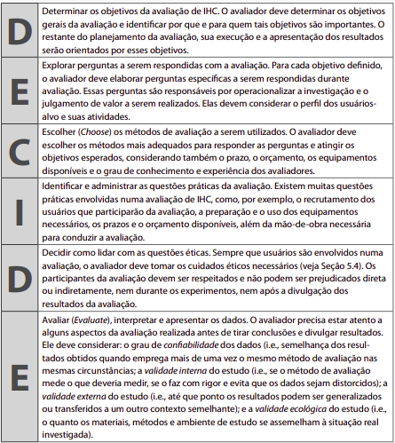

# Site escolhido

   
   <figcaption> Faculdade de Arquitetura e Urbanismo </figcaption>

***

### Histórico de Versões

**Data** | **Versão** | **Descrição** | **Autor(es/as)** | **Revisor**|
--- | --- | --- | --- | --- |
08/07/2022 | 0.1 | Criação do documento e descrição de tópico introdutório _Avaliação_ | Matheus Costa | Caio César |
09/07/2022 | 0.2 | Adição dos tópicos _Objetivos_ e _Método de avaliação_ | Matheus Costa | Letícia Aires
18/07/2022 | 0.3 | Adição do tópico da _Avaliação Heurísitca_ | Matheus Costa | Caio César

## Introdução
A avaliação do site foi feita com base no _framework_ DECIDE (imagem 1), proposto por Sharp, Rogers e Preece (2007) para auxiliar no processo de uma avaliação de IHC (BARBOSA; SILVA; 2010, p. 312).

Ele basicamente estabelece que é preciso determinar os **objetivos** da avaliação, em seguida escolher **métodos de avaliação** adequados, **identificar** as questões práticas envolvidas, como perfis dos usuários e um escopo de avaliação definido, e por fim **avaliar** os dados.

   
   <figcaption> Imagem 1: Framework DECIDE </figcaption>

## 1. Objetivos

Durante o processo de avaliação de IHC é importante definir alguns dos **objetivos** da avaliação, pois são eles que irão determinar quais aspectos relacionados ao uso do sistema devem ser observados. Esses objetivos geralmente são detalhados por meio de perguntas a serem respondidas.

Dentre os objetivos estabelecidos temos:

- Identificar problemas na interação com o sistema.
- Analisar se o usuário consegue atingir seus objetivos.
- Se há uma conformidade com um padrão.

Algumas perguntas a serem respondidas:

- A interface do sistema é intuitiva?
- O usuário consegue atingir seu objetivo com facilidade?
- Os links da página redirecionam para um local esperado?
- O usuário possui controle sobre o sistema?
- Existe alguma ideia alternativa de design?

## 2. Método de avaliação
Para a escolha do método de avaliação, consideramos uma metodologia do tipo por **inspeção**, que, de acordo com Barbosa e Silva (2010), é um tipo que permite ao avaliador examinar (ou inspecionar) uma solução de IHC para tentar antever as possíveis consequências de certas decisões de design sobre as experiências de uso, além de que, costumeiramente, métodos de avaliação desse tipo são mais rápidos e de custo de execução mais baixo se comparados a outros métodos como os de investigação e de observação. (BARBOSA; SILVA; 2010, p. 302).

Escolhido o tipo da metodologia, a execução da avaliação foi feita por meio de uma **Avaliação Heurística**, que é um método baseado na verificação de uma lista de princípios (heurísticas) de usabilidade, propostos por Nielsen, no qual os avaliadores visam, de forma fácil e rápida, descobrir grandes problemas potenciais da interface. (MACIEL _et al._, 2004, p. 6)

## 3. Avaliação Heurística

Como citado anteriormente, segundo Preece, Rogers e Sharp (2005, p. 48-49), Nielsen propôs alguns princípios de usabilidade, que são usados como base para avaliação de algum sistema. Ao todo foram propostos 10 princípios, os quais são: 

- **Visibilidade** do status do sistema: manter o usuário informado sobre o que está acontecendo, sempre passando um _feedback_; 

- **Compatibilidade do sistema**: o sistema deve possuir uma linguagem que o usuário entenda;  

- **Controle do usuário e liberdade**: o usuário deve possuir liberdade para sair de um lugar indesejado e retornar a um estado anterior, sem ter que passar por um processo muito longo e utilizando "saídas de emergência" claramente identificadas;  

- **Consistência e padrões**: evita fazer com que os usuários tenham que pensar se situações, palavras ou ações diferentes significam a mesma coisa, facilitando o aprendizado do usuário, através de interfaces que apresentam operações similares para usos similares em tarefas similares;  

- **Reconhecer, diagnosticar e corrigir erros**: ajudar o usuário por meio de linguagem clara, como em mensagens de erro por exemplo, indicando o problema e sugerindo uma solução;  

- **Prevenção de erros**: oferecer um design cuidadoso, que ajude a prevenir algum erro;  

- **Reconhecimento**: ao invés de memorizar alguma informação, o usuário deve ter as instruções à sua disposição de forma bem visível e facilmente recuperável;  

- **Flexibilidade e eficiência**: permitir atalhos para ações mais frequentes, aumentando a velocidade;  

- **Estética e design minimalista**: evitar informações irrelevantes, que muitas vezes podem comprometer a visibilidade de informações relevantes;  

- **Ajuda e documentação**: informações devem ser fáceis de encontrar e ajuda mediante uma série de passos concretos que podem ser facilmente seguidos.

## Referências
> BARBOSA, Simone; SILVA, Bruno. **Interação Humano-Computador**. 1ª Edição. Elsevier, 2010.

> MACIEL, Cristiano _et al_. **Avaliação Heurística de Sítios na Web**. Instituto de Computação - Universidade Federal Fluminense (UFF), 2004. Disponível em: [docplayer.com.br/1827066-Avaliacao-heuristica-de-sitios-na-web.html](https://docplayer.com.br/1827066-Avaliacao-heuristica-de-sitios-na-web.html). Acesso em: 09 de jul. de 2022.

> PREECE, Jennifer; ROGERS, Yvonne; SHARP, Helen. O que é _Desing_ de Interação?. **Design de Interação: Além da Interação Humano-Computador**. 1ª Edição. Bookman, 2005.

